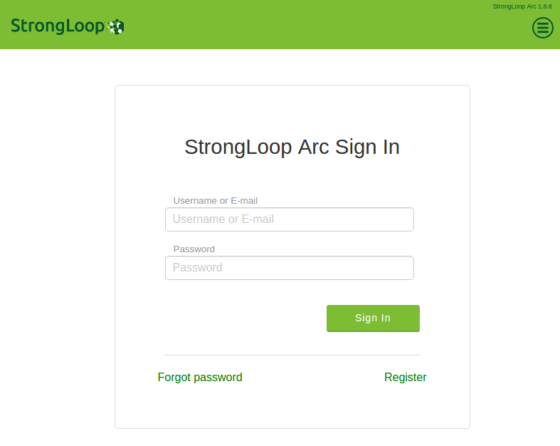

---

title: "loopback으로 API Gateway 구축하기"

author: noizbuster

date:   2016-05-15 00:00:00

category: development

tags: [web, micro service architecture, msa, loopback]

---

## 서론
Micro Service Architecture 에 대해서는 다음 링크에 조대협님이 쉽게 잘 설명해주셨다.  
[조대협의 블로그 - 마이크로 서비스 아키텍쳐 (MSA의 이해)](http://bcho.tistory.com/948)

이번 포스팅에서는 Loopback을 사용할것이다.  
Loopback 은 IBM의 자회사인 StrongLoop가 만든 API Gateway 미들웨어이다  
[Loopback.io](http://loopback.io/) 에서 문서들과 예제들을 확인 할 수 있다.  

## 설치와 초기 세팅
```
sudo npm install -g strongloop
```
설치가 끝나면 프로젝트 디렉토리를 하나 만들고 `slc loopback` 명령어로 프로젝트를 생성한다.
```
mkdir project-name
cd project-name
slc loopback
```
그러면 yeoman이 트리거되고 설치가 시작된다. 과정중에 프로젝트 이름, 디렉토리 이름, 보일러플레이트의 타입 등을 고르라고 프로그램이 물어볼것이다.

나는

* project name
* enter (accept default value)
* hello_world 선택

순으로 대답했다.

완료되면 다음과 같은 안내를 받는다.
```
Next steps:

  Change directory to your app
    $ cd project-name

  Create a model in your app
    $ slc loopback:model

  Compose your API, run, deploy, profile, and monitor it with Arc
    $ slc arc

  Run the app
    $ node .
```

시키는대로 `slc:loopback:model` 명령어로 모델을 하나 만들어보자
```
slc loopback:model
? Enter the model name: proj
? Select the data-source to attach undefined to: (no data-source)
? Select model's base class PersistedModel
? Expose proj via the REST API? Yes
? Custom plural form (used to build REST URL): proj
? Common model or server only? server
Let's add some proj properties now.

Enter an empty property name when done.
? Property name: version
   invoke   loopback:property
? Property type: string
? Required? Yes
? Default value[leave blank for none]: 0.0.1

Let's add another proj property.
Enter an empty property name when done.
? Property name:
```

잘 만든것인지 판단이 안선다. 아무렴 어때 나중에 바꿀수 있겠지

그다음, 위에서 시켰던대로 `slc loopback:arc` 로 web-ui 툴을 켠다.  
`StrongLoop Arc is running here: http://localhost:57649/#/`
나의 경우 57649 포트에 열렸다.
  
난감하다 뭔가 계정을 생성한 기억은 없는데...  
알아보니 이 계정은 로컬계정이 아니다 strongloop에서 가입을 해야한다.

__이부분은 솔직히 맘에 안든다. arc 툴을 유료로 전환할 여지를 주는것인지, 내 API Gateway의 설정을 수집하겠다는것인지 모르겠지만 내가 example 만 보고 진행함에 있어서 이 내용에 대해 읽은것이 없었기 때문에 오해의 소지가 있다.__  
그럼 이걸 어찌해야할까? 일단은 arc 를 사용하지 않고 그냥 CLI 와 에디터로 해결 해 보도록 하겠다.

그럼 실행을 해보자
```
node .
or
npm start
```
로 실행하면 된다.

localhost:3000/explorer 로 붙으면 현재 만들어져있는 api list 들을 볼 수 있다.

## 적용

기존에 있는걸 사용하기 위해서 레거시 API server에 있는걸 하나 redirection 해서 써 보자. 이거만 가능하면 적어도 여러개의 포트에서 오는걸 하나로 합치는건 웹서버 밑에다가 express 라우팅을 할 필요는 없어진다.

일단, Express의 router 를 그대로 써서 물릴수가 있다. 이건 기존에 있던 express 레거시 라우터를 마이그레이션 할 때 쓰면 되겠다.

그 이외엔 datasource 를 만들어서 기존의 REST를 가져올 수 있다. 일단은 GET request 만 알아보았는데.  
slc loopback:datasource 를 이용해서 생성하면 되고 커넥터를 REST로 선택하면 된다.
이후 생성된 파일을  
[strongloop/loopback-example-connector/REST](https://github.com/strongloop/loopback-example-connector/tree/rest)  
의 예제처럼 수정해주면 된다.

## 라이선스
Loopback의 많은 부분들이 듀얼라이선스를 사용하고있다. MIT 와 자기네들이 만든 StrongLoop Subscription Agreement. 라는걸 사용한다. 따로 조건이 없기 때문에 둘중에 원하는걸 선택해서 사용해도 (아마도 MIT를) 합법이다. 하지만 문제는 Loopback 전부가 다 듀얼라이선스가 아니라는점이다. API connect 의 경우에는 듀얼라이선스가 아니라 StrongLoop Subscription Agreement만 명기되어있고 DB커넥터의 과반수도 그렇다. 이런경우에는 사용상에 제약이 생긴다.
