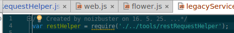
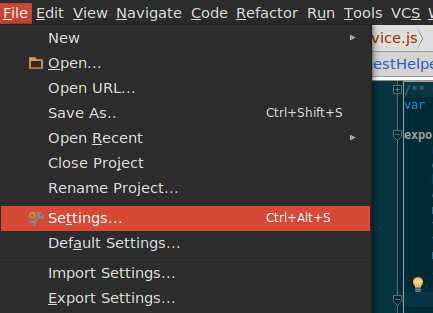
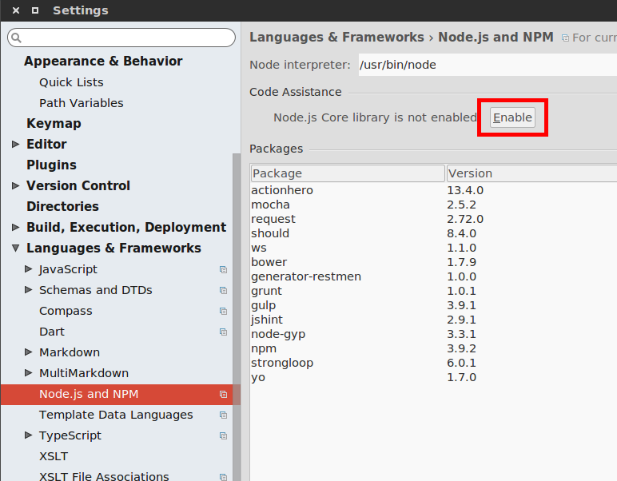

---

title: "webstorm에서 node관련 함수들을 찾을수 없다고 나올때 해결법"

author: noizbuster

date:   2016-05-25 00:00:00

category: development

tags: [nodejs, webstorm, ide]

---

Webstorm에서 node등을 지원한다고 하는데 빨간줄이 죽죽 그어져있는 모습이 보이곤한다.

설정을 좀 해줘야한다.

설정으로 가서

Language & Frameworks > Node.js and NPM 으로가서  
Code Assistance 를 Enable 해주면 된다.
