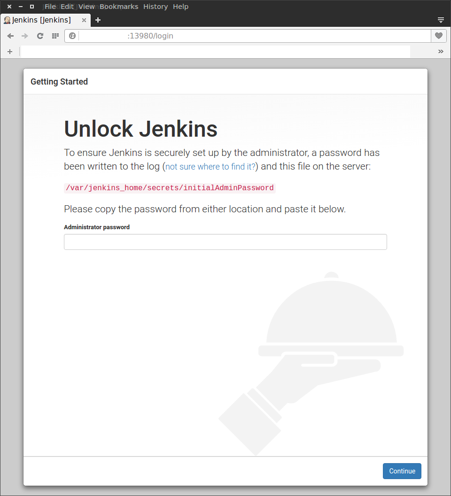
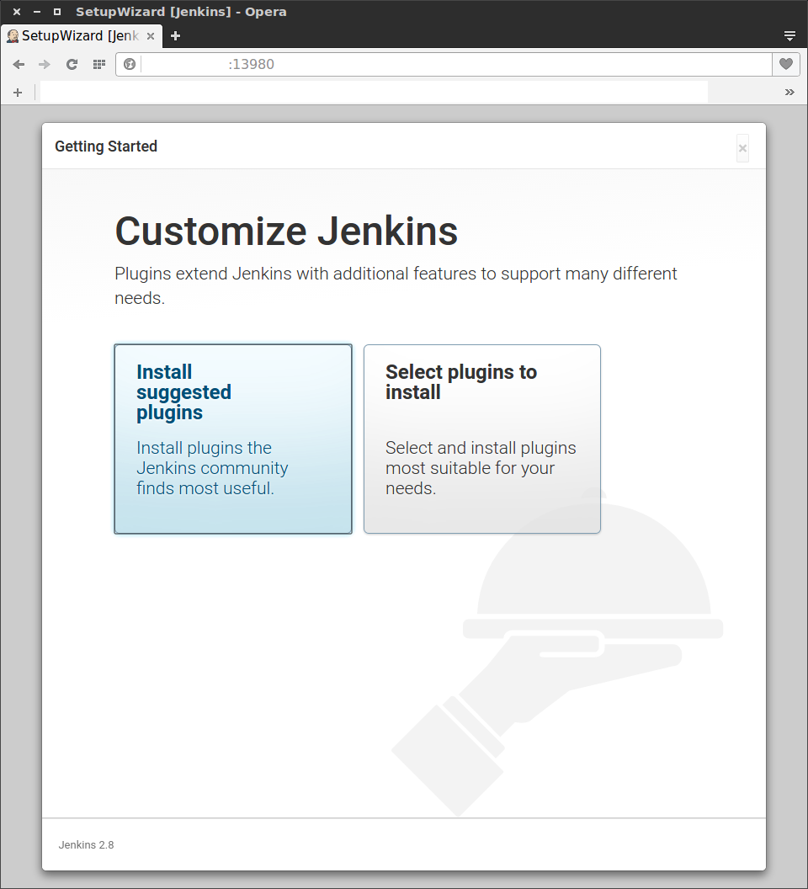
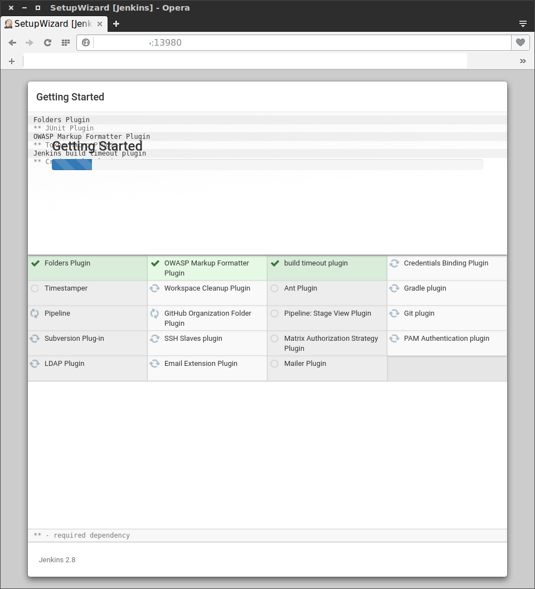
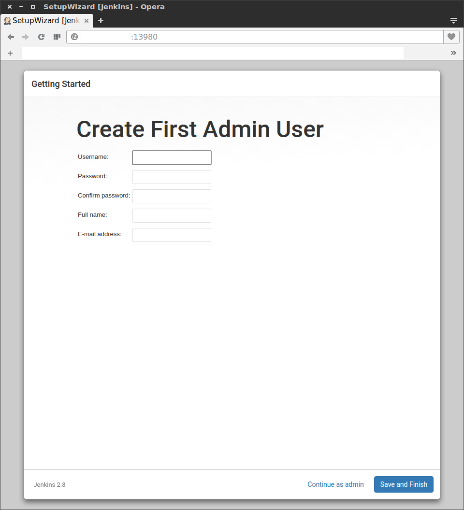

---

title: "Jenkins2 설치 및 구성 (docker)"

author: noizbuster

date:   2016-06-14 10:00:00

category: development

tags: [jenkins, jenkins2, ci, cd, docker]

---

## 설치
Jenkins2 를 설치한다 docker 이미지를 제공하니까 이걸 쓰도록 한다.  
20160614 현재 최신버전은 2.8  
https://hub.docker.com/r/jenkinsci/jenkins/tags/

```
sudo docker run \
  -p 13980:8080 \
  -d \
  jenkinsci/jenkins
```
로 실행  
컨테이너의 8080 포트를 13980으로 바인드 한다.  

## 초기 설정
http://my-ip:13980 로 접속하면  

/var/jenkins_home/secrets/initialAdminPassword 으로 들어가서  
초기 비밀번호를 입력하라는 화면을 보게 된다.

도커의 shell 에 붙어서 파일을 읽으면 된다.  
`sudo docker exec -ti containdername bash` 로 쉘에 붙자  
`cat /var/jenkins_home/secrets/initialAdminPassword` 으로 확인할 수 있다.  

  
다음은 이런 화면인데 Install suggested plugins 를 선택하면 된다  
나중에 필요한 플러그인은 나중에 언제라도 설치할 수 있기 때문에 망설일 필요 없다.

  
그러면 젠킨스 씨가 이렇게 열심히 기본 플러그인을 깔아준다.

  
초기 계정을 하나 만들어주자, 만약 회사나 단체라면 관리자 계정을 만든다고 생각하면 된다.  
나중에 내가 쓸 계정은 따로 만들어서 쓰는게 관리상 편할것이다.  
Manage Jenkins -> Manage Users -> Create User 에서 다른 유저를 만들수 있고  
Manage Users 메뉴에서 상세 설정할 수 있다.
