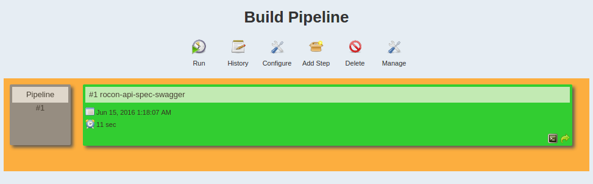

---

title: "Jenkins2 create pipeline job"

author: noizbuster

date:   2016-06-14 14:20:00

category: development

tags: [jenkins, jenkins2, ci, cd]

---

### 환경  
jenkins server : ubuntu 12.04  
jenkins : v2.8  
작업환경 : ubuntu 14.04  

### 사족
freestyle job 은 마우스 클릭만 할 줄 알면 기본적인 빌드를 만들 수 있기 때문에 정리가 무색한것 같아서 다음으로 미루도록 하겠다.

## 동기
단계가 복잡하거나 하는 일이 많은 job 의 경우 pipeline job 으로 만드는것이 좋은것 같다.  
jenkins2 부터는 설치시에 추천 플러그인으로 설치를 해 준다.

https://github.com/jenkinsci/pipeline-plugin/blob/master/TUTORIAL.md  
여기를 시작으로 해보도록 하겠다.  

## 목표
내가 필요한것은

1. git repository로 부터 코드 받기
1. swagger-codegen 으로 webserver 생성하기 (kind of build)
1. docker image 로 빌드하기
1. 서버에서 이미 돌고 있는 컨테이너 내리기
1. 서버에 이미지를 밀어넣거나 그쪽에서 pull 받아서 실행시키기  
(이때 포트를 8080이 아닌 다른것으로 설정)

으로 정리된다.

swagger-codegen 을 사용해서 웹서버를 생성하는것은 쉘 스크립트로 짜져있는 상태고  
dockerfile이랑 이것을 이용해서 dockerimage 를 생성 할 수 있는 스크립트도 있다.  

## pipeline 생성하기
pipeline 플러그인이 깔려있다면  
  
에 표시된 + 버튼 을 눌러서 Build Pipeline Veiw 를 추가하자  
나중에 다 수정 할 수 있으니 이름정도만 정해주고 넘어가도 된다.  
___tip: 만약 추가중에 취소를 하거나 다른 페이지로 넘어가고 나서 동일한 이름으로 view 를 만드려고 했는데 중복된 이름이라고 나오면서 안될때는 맨위에 검색창에 그 이름으로 검색해서 지우거나 수정하면 된다.___

### Initial Job
Pipeline 이 시작되는 지점을 정해주어야 한다.  
  
-> 만든 Pipeline View을 선택하고 Add Step 을 눌러서 job 을 추가하자.

  
-> 나의 경우 repository 로부터 빌드를 시작하면 되기 때문에 관련 정보를 입력했다.

  
-> 5분마다 polling 해서 바뀐점이 있는지 체크하고 있다면 빌드를 시작하게 된다.

Build shell script 로 만들어놨기 때문에 이것을 실행만 하면 된다.  
Execute shell을 선택하고 sh generate.sh 명령만 덜렁 적어놓았다.

  
-> 저장하고 나서 configure 를 선택하고

  
-> 방금 만든 job 을 선택하고 저장하면

  
-> 이렇게 파이프라인이 추가 되었다.

### Build Docker Image
~~다음 job 을 만드는데 freestyle job 을 만들어서 릴레이 하는지 pipeline 을 만드는건지 잘 모르겠다.~~  
freestyle job 으로 만들어서 트리거를 이전작업으로 설정하니까 빌드 파이프라인에 잘 보인다.  
workspace 는 job 의 이름으로 되어있는 동일 레벨의 디렉토리가 있었고 별 문제없이 access 가 되었다. 만약 문제가 복잡해지거나 서로 비동기적으로 동작한다는것을 가정한다면 custom workspace 를 이용해서 구현해야 할 거 같다.

_궁금한건 이전 작업으로 트리거 하는부분을 watch 라고 표현이 되어있는데 이게 스레드 돌면서 dirty check 하는것인지 내부적으로 이벤트 핸들링을 해주는지 모르겠다. 만약 안된다면 첫번째 작업 다음에 다음작업을 예약하는것이 더 효율이 좋을것이라고 생각된다._  

우선 Docker build step plugin 을 설치한다.  
  
이렇게 했는데 에러를 뿜으면서 제대로 빌드가 안된다.  
https://github.com/jenkinsci/docker-plugin/issues/389  한계가 있어보인다.  
native CLI atm을 쓰는게 더 나을거라는 말을 해주는데 뭔지 모르겠음.

일단은 docker image build 대신 ssh 로 artifact 를 서버로 밀어넣고 실행시켜 보겠다.

새로운 freestyle job 을 하나 만들고 빌드에서 shell cmd 로 먼저 처리를 한다.
```
echo copy artifact from previous step
ls ./../api-spec-swagger
cp ./../api-spec-swagger/bin . -r
ls -al
sed -i 's/8080/13981/g' ./bin/api_spec/index.js
cat ./bin/api_spec/index.js
```
로 다른 workspace 에서 파일을 복사 해 온다음 내부에 8080 포트를 13981로 변경해주었다.

이제 ssh로 접속해서 파일들을 복사해주고
```
cd api_swagger
cd bin
cd api_spec
npm install
pm2 stop index
pm2 start index.js
```
ssh로 다음 명령어를 실행해서 서버에서 실행시킨다.
_pm2 node processor manager 로 name 으로 프로세서 관리를 편하게 해_

## pipeline script 작성
```
node {
    git url: 'https://github.com/user/reponame.git'
}
```
